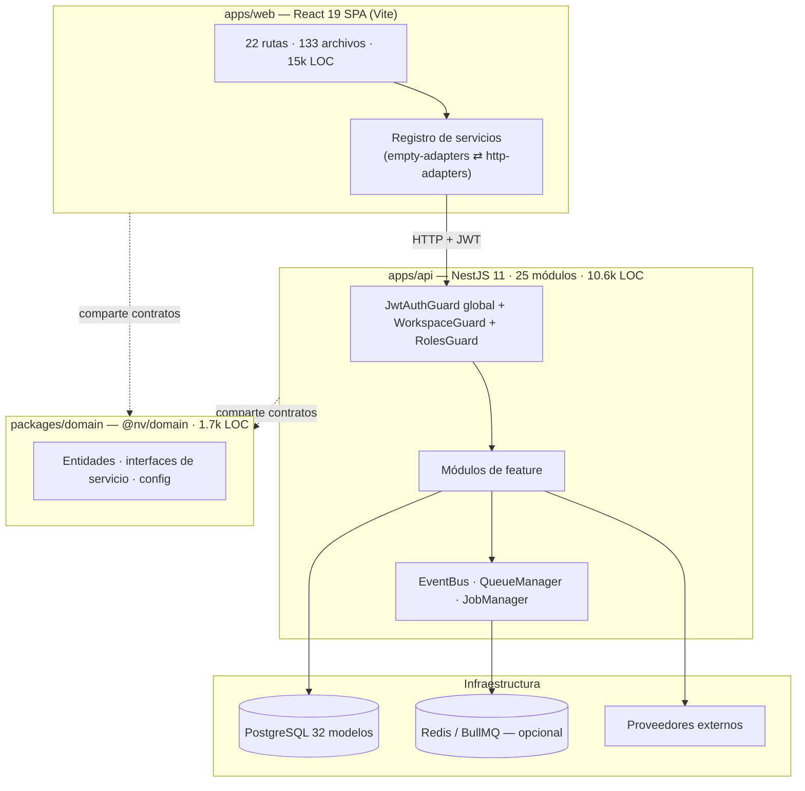

# NV Core — Auditoría Técnica, Funcional y Estratégica (CTO)

> **Rol:** CTO entrante, auditando un software heredado. **No asumo nada; verifico.**
> **Método:** lectura de código + ejecución real de build/tests + métricas del repo.
> **Fecha:** 2026-08-06 · **Rama auditada:** `claude/multi-workspace-platform-setup-67l48t` (112 commits, sin merge a `main`, sin tags).
> **Sesgo declarado:** descuento explícitamente las auto-evaluaciones "premium" del propio proyecto. Un módulo con UI pulida **no** es un módulo terminado.

---

## 0. Resumen ejecutivo

NV Core es un **monorepo bien construido en lo técnico pero inmaduro como producto comercial**. La higiene de código es genuinamente alta (TypeScript estricto sin `any` significativo, 0 TODO, 0 `console.log`, arquitectura de contratos coherente, guards de seguridad consistentes, 250 tests que pasan). Eso es real y poco común.

Pero **"limpio" no es "terminado"**. La promesa central del producto —marketing omnicanal (WhatsApp, Meta, Telegram, TikTok)— descansa sobre **integraciones frágiles o no probadas contra servicios reales**: WhatsApp usa Baileys (librería no oficial, riesgo de baneo y de ToS), el publicador de Meta jamás se ha ejercitado contra la Graph API real (solo mocks), y TikTok/otros son stubs honestos que reportan "no configurado". La plataforma **no tiene ninguna capa de adopción** (onboarding, ayuda, changelog, estado), y varios módulos "completos" son en realidad **cascarones pulidos** (el Marketplace instala apps que no hacen nada; el editor de workflows no ejecuta ramas condicionales).

**Veredicto de release (Fase 10): 🔴 NO.** No por bugs bloqueantes visibles —los que se detectaron se corrigieron— sino porque **el producto no está probado de extremo a extremo en sus caminos de dinero, no tiene experiencia de adopción, y su base de integraciones es un riesgo estratégico sin mitigar.**

| Dimensión | Nota (0–10) | Una frase |
|---|---:|---|
| Calidad de ingeniería / higiene | **8.5** | Por encima de la media; base sólida y consistente. |
| Arquitectura | **7.5** | Patrón claro y desacoplado; deuda en escalabilidad de datos. |
| Completitud funcional (shell) | **8.0** | Casi todo está *presente* en la UI. |
| Completitud funcional (real, producción) | **5.5** | Poco está *probado punta a punta*. |
| Integraciones / providers | **4.0** | El mayor riesgo. Frágiles o no verificadas. |
| Seguridad | **7.0** | Buen núcleo; 2 decisiones de política abiertas. |
| Testing / QA | **5.5** | 250 tests, pero cobertura desigual y sin gate. |
| UX | **7.0** | Consistente y pulida; sin guía para el usuario nuevo. |
| Preparación de producto | **5.0** | Faltan diferenciadores y profundidad. |
| Preparación de negocio | **3.5** | Sin onboarding, ayuda, import/export, licenciamiento. |
| Operabilidad / DevOps | **6.0** | Docker+CI+backups+health; sin HA ni observabilidad profunda. |
| **Global ponderado** | **≈ 5.8 / 10** | **Prototipo comercial avanzado, no producto vendible.** |

**Estimación honesta de completitud:** *funcionalidad presente* ~85%; *listo para vender a un cliente de pago* **~55%**.

---

## FASE 1 — Inventario completo (verificado)

### 1.1 Arquitectura

**Patrón central:** *contratos primero*. `@nv/domain` define entidades e interfaces de servicio; la web tiene dos implementaciones intercambiables (adaptadores vacíos = modo demo; adaptadores HTTP = backend real), y la API implementa un módulo NestJS por servicio. **Fortaleza real**: bajo acoplamiento UI↔backend. **Riesgo**: gran parte de la UI "funciona" en modo demo sin tocar el backend, lo que **enmascara** qué está realmente probado punta a punta.

### 1.2 Tecnologías (verificado en package.json)

| Capa | Stack |
|---|---|
| Monorepo | pnpm workspaces + Turborepo |
| Frontend | React 19, Vite 6, react-router v6, TanStack Query v5, Zustand, TailwindCSS, shadcn/Radix, recharts, socket.io-client, sonner, lucide-react |
| Backend | NestJS 11, Prisma 6 / PostgreSQL, BullMQ + ioredis, socket.io, class-validator/transformer, helmet, @nestjs/throttler, @nestjs/jwt, zod, @sentry/node |
| Mensajería | @whiskeysockets/baileys (WhatsApp no oficial), Meta Graph (fetch), Telegram Bot API |
| Testing | Vitest (unit), Playwright (E2E) |

**Dependencias de producción:** API **24**, Web **23**, Dominio **0**. Cifra sana y contenida — sin `moment`, sin `lodash` completo, sin bloat evidente.

### 1.3 Backend (25 módulos)

`ai, analytics, audit, automations, billing, calendar, campaigns, connections, contacts, designs, groups, inbox, integrations, marketplace, media, messaging, notifications, posts, scheduler, segments, social, team, templates, whatsapp, workspaces`

### 1.4 Frontend (22 rutas)

Auth (5): login, register, forgot/reset-password, verify-email.
Workspace (17): dashboard, ai, analytics, automatizaciones, biblioteca, builder, calendario, campanas, conexiones, configuracion, contactos, grupos, historial, inbox, marketplace, plantillas, segmentos.

### 1.5 Base de datos (32 modelos Prisma, 18 migraciones, 35 índices)

`User, AuthToken, RefreshToken, Membership, Contact, Group, GroupVariable, Segment, Campaign, CampaignTarget, SendLog, Post, Connection, MediaFolder, MediaAsset, Template, Automation, CalendarEvent, Conversation, Message, Notification, AuditLog, Workspace, GoogleConnection, WhatsappSession, Job, ProviderSelection, AiUsage, BillingAccount, Design, ContactNote, AppInstallation`

Migraciones **aditivas y ordenadas** (compatibles con la versión anterior en despliegue). **Bien.**

### 1.6 Integraciones / Providers / Adapters (8 adaptadores)

`base, browser-automation, meta-graph, resend, telegram-bot-api, tiktok-official-api, whatsapp-baileys, whatsapp-cloud-api` + Google OAuth, Cloudinary (uploads firmados), Stripe (billing), n8n (bridge de automatización).

### 1.7 Infra async (core)

`EventBus` (eventos de dominio), `QueueManager` (BullMQ/Redis, con fallback *inline* sin Redis), `JobManager` (estado/reintentos/fallos). Workers: `CampaignRunner` (tick 30s), `PostScheduler` (publicación programada). **Diseño correcto**; ver riesgos de fiabilidad en Fase 4/8.

### 1.8 Métricas del código (medidas)

| Área | LOC | Archivos | Tests |
|---|---:|---:|---:|
| API (src) | 10.614 | 108 | 33 specs / 2.580 LOC |
| Web (src) | 15.006 | 133 | 8 specs / 723 LOC |
| Dominio | 1.676 | 13 | **0** |
| E2E | 450 | 8 | — |
| **Total prod.** | **~27.300** | **254** | **250 unit + 8 E2E** |

---

## FASE 2 — Estado del proyecto (tabla maestra)

> Porcentajes conservadores, basados en *código real vs. estándar comercial*, no en la UI. "Calidad": A (sólido/probado) · B (funcional, huecos) · C (cascarón/frágil).

| Módulo | Estado | % | Calidad | Dependencias | Problemas | Prioridad | Riesgo | Observaciones |
|---|---|---:|:--:|---|---|:--:|:--:|---|
| Auth (JWT+refresh+reset) | Funcional | 85% | A | Prisma | Sin MFA, sin lockout de cuenta, scrypt (no argon2) | Media | Bajo | Núcleo bien probado (3 specs). |
| Multi-tenancy / Workspaces | Funcional | 75% | B | Auth | CRUD de workspace **sin tests**; `GET /workspaces` público enumera tenants | Alta | **Alto** | Aislamiento sí probado (E2E). |
| RBAC / Team | Funcional | 70% | B | Auth | Flujo de invitación sin test; permisos no auditados a fondo | Media | Medio | Roles reales, gate en controladores. |
| Contactos / CRM | Funcional | 80% | B | — | Cap de 100 en frontend (búsqueda pierde >100), sin campos custom/tareas/import | Alta | Medio | Kanban + notas reales. |
| Campañas + Runner | Funcional | 70% | B | Providers, colas | Entrega depende de providers frágiles; sin A/B ni métricas por campaña | Alta | **Alto** | Runner probado (9 specs) con mocks. |
| Inbox omnicanal | Funcional | 65% | B | Providers, socket | Depende de providers; sin respuestas rápidas/SLA/plantillas | Alta | **Alto** | Tiempo real vía socket.io. |
| Analytics | Funcional | 70% | B | — | Agregación en JS (no SQL), sin cohortes ni exportación | Media | Medio | Período/deltas/heatmap reales. |
| Workflow Builder | Parcial | 55% | C | n8n | **No ejecuta ramas condicionales**, sin test-run; editor visual sí | Alta | Alto | Cascarón visual + bridge n8n. |
| Campaign/Design Builder | Parcial | 60% | B | — | Sin plantillas prediseñadas, sin multiselección | Media | Bajo | Editor por capas + export SVG. |
| AI Studio | Funcional | 65% | B | Providers IA | Sin generación de imágenes; depende de claves de IA | Media | Medio | Variantes/hashtags/plantillas, metering. |
| Media Library | Funcional | 70% | B | Cloudinary | Sin versionado/compresión | Baja | Bajo | Uploads firmados reales. |
| Marketplace | **Cascarón** | 30% | C | — | Instala apps que **no hacen nada**; sin runtime de apps | Media | Medio | Catálogo + persistencia, cero función. |
| Providers/Integraciones | Parcial | 40% | C | Externos | Baileys (no oficial/baneo), Meta no probado en real, TikTok stub | **Crítica** | **Muy alto** | El núcleo de valor, sin verificar. |
| Billing (Stripe) | Funcional | 60% | B | Stripe | Gating por plan superficial; sin métricas de uso facturables | Media | Medio | Checkout/portal/webhook probados. |
| Notificaciones | Funcional | 70% | B | — | Sin push/email real de todos los tipos | Baja | Bajo | Lista + marcar-leídas (recién arreglado). |
| Calendario | Funcional | 75% | B | — | Sin sync bidireccional real (Google parcial) | Baja | Bajo | DnD + vistas + atajos. |
| Plantillas / Grupos / Segmentos | Funcional | 65% | B | — | Segmentos sin evaluación automática de reglas | Media | Medio | CRUD reales; reglas no ejecutan. |
| Conexiones (OAuth hub) | Parcial | 45% | C | Externos | Flujo OAuth real "por habilitar"; UI presente | Alta | Alto | Cascarón de conexión. |
| Observabilidad | Parcial | 50% | B | Sentry | Sin métricas/tracing/dashboards | Media | Medio | request-id + Sentry opcional. |
| Adopción (onboarding/ayuda/...) | **Inexistente** | 0% | — | — | No existe nada | **Crítica** | **Alto** | Bloqueante comercial. |

---

## FASE 3 — Análisis funcional

Leyenda: **E**xiste · **F**unciona · **C**ompleto · **P**roducción-ready.

| Funcionalidad | E | F | C | P | Qué falta / problemas / edge cases sin cubrir |
|---|:-:|:-:|:-:|:-:|---|
| Registro / login / refresh | ✅ | ✅ | ✅ | ⚠️ | Falta MFA, lockout por cuenta, rate-limit distribuido. Reset/verify probados. |
| Aislamiento entre tenants | ✅ | ✅ | ✅ | ✅ | Probado por E2E (403/401). Enumeración pública de workspaces es fuga. |
| CRUD Contactos + pipeline | ✅ | ✅ | ⚠️ | ⚠️ | >100 contactos: búsqueda cliente falla. Sin import CSV, sin dedupe. |
| Envío de campaña WhatsApp | ✅ | ⚠️ | ⚠️ | ❌ | Runner probado con **mocks**; nunca verificado contra WhatsApp real. Baileys puede desconectar/banear. Sin reintento por destinatario configurable. |
| Publicación Meta (FB/IG) | ✅ | ❓ | ⚠️ | ❌ | Código completo (feed/foto/reel/carrusel) pero **jamás ejecutado contra Graph real**. Manejo de expiración de token, límites de rate y errores de media no verificado. |
| Inbox tiempo real | ✅ | ⚠️ | ⚠️ | ❌ | Depende de webhooks entrantes + socket; sin verificación end-to-end con proveedor real. |
| Programación de posts | ✅ | ⚠️ | ✅ | ⚠️ | Requiere Redis; sin él, "queda programado" y no publica. Idempotencia probada. |
| Analytics | ✅ | ✅ | ⚠️ | ⚠️ | Agrega en memoria; a escala grande es lento. Sin cohortes/export. |
| Workflow automation | ✅ | ⚠️ | ❌ | ❌ | Editor visual sí; la **ejecución de condiciones/ramas no está**. n8n oculto. |
| Marketplace de apps | ✅ | ⚠️ | ❌ | ❌ | Instala/desinstala, pero las apps no tienen runtime ni efecto. |
| Facturación | ✅ | ✅ | ⚠️ | ⚠️ | Stripe checkout/portal/webhook OK; gating por plan poco profundo. |
| IA generación de texto | ✅ | ✅ | ⚠️ | ⚠️ | Metering real; sin imágenes; depende de claves externas y de su coste. |
| Media / uploads | ✅ | ✅ | ✅ | ⚠️ | Cloudinary firmado; sin versionado ni límites de cuota. |
| Onboarding / ayuda | ❌ | ❌ | ❌ | ❌ | No existe. |

**Conclusión Fase 3:** el producto **existe** casi por completo a nivel de interfaz, pero **la fila "Producción-ready" está dominada por ⚠️/❌ justo en los caminos de dinero** (envío/publicación/inbox). Eso es lo que un cliente pagaría y es lo menos verificado.

---

## FASE 4 — Auditoría técnica

**Lo genuinamente bueno (verificado):**
- **Higiene:** 0 TODO/FIXME, 0 `console.log`, 0 `@ts-ignore`, solo **2** `eslint-disable`, 0 `dangerouslySetInnerHTML`. TS estricto. `typecheck` y lint (web+api) pasan.
- **`any`:** solo **18**, concentrados en `baileys.session.ts` (11, librería externa), `meta.service.ts` (4, respuestas Graph) y `browser-automation` (3). Aceptable y localizado.
- **Seguridad de base:** guard JWT global, `WorkspaceGuard`+`RolesGuard` consistentes, scoping por `workspaceSlug` del guard (no del body), Prisma parametrizado (0 SQL raw), cifrado AES-256-GCM de tokens en reposo, webhooks Stripe con HMAC.
- **Separación de responsabilidades:** contratos en dominio, DI limpia, workers desacoplados por EventBus/colas.

**Deuda y problemas (verificado):**

| Área | Hallazgo | Severidad |
|---|---|:--:|
| **Escalabilidad de datos** | **39 de 41 `findMany` sin `take`/paginación**. `inbox.messages` devuelve el hilo completo; varias listas devuelven la tabla entera del tenant. | **Alta** |
| Índices | 35 índices, pero **faltan compuestos `(workspaceSlug, createdAt)`** para el patrón de consulta dominante (lista + orden por fecha). | Media |
| Frontend a escala | Contactos capado a 100 y filtrado en cliente → **bug de correctitud** >100. Sin virtualización de listas. | Media |
| Analytics | Cuenta en JS trayendo filas (incl. `Message`); no usa agregación SQL. | Media |
| Acoplamiento a Baileys | 11 `any` y lógica de sockets fuertemente acoplada a una librería no oficial y volátil. | Alta |
| SOLID | Correcto en general. Algunos módulos colocan controller+service+DTOs en un solo `*.module.ts` (p.ej. `contacts.module.ts` 254 LOC) — legible pero mezcla responsabilidades de archivo. | Baja |
| Duplicación | Baja. Patrones repetidos (adaptadores) son intencionales, no copy-paste. | Baja |
| Código muerto | No detectado de forma relevante. | — |
| Versionado | **112 commits en una rama nunca fusionada a `main`, sin tags, sin releases.** No hay historial de versiones del producto. | Media (proceso) |

**Nomenclatura/organización:** consistente (mezcla ES/EN en dominio de negocio en español; aceptable pero decidir i18n).

---

## FASE 5 — Auditoría UX (recorrido como usuario nuevo)

**Dónde me pierdo / qué confunde:**
1. **Aterrizaje frío.** Tras registrarme caigo en un dashboard **vacío** sin tour, sin datos de ejemplo, sin "primeros 3 pasos". No sé qué hacer primero. *(Bloqueante de activación.)*
2. **Conexiones**: el hub de OAuth muestra tarjetas pero el flujo real "se habilitará" — el usuario intenta conectar y no pasa nada claro. Frustración temprana.
3. **Marketplace**: instalo una app y **no ocurre nada** después. Rompe la expectativa.
4. **Workflow builder**: puedo dibujar un flujo con condiciones pero no ejecuta ramas — expectativa incumplida.
5. **Demo vs. real**: sin `VITE_API_URL`, toda acción responde "no disponible en modo demo". Si un build sale mal configurado, el producto entero parece un cascarón clicable.

**Qué es excelente:**
- Consistencia visual y de estados (skeleton → vacío → error → datos) en **todas** las pantallas vía `QueryBoundary`. Raro y valioso.
- Calendario y Media Library marcan el estándar (filtros, acciones in-place, DnD).
- Accesibilidad base sólida: skip-link, landmarks, diálogos Radix con foco atrapado, `prefers-reduced-motion`, focus rings.

**Qué necesita rediseño / simplificación:**
- El editor de **workflows** es 100% ratón (nodos sin teclado) — inaccesible para AT.
- Dashboard: aunque ya lista datos, sigue siendo más "panel de estado" que "centro de acción".
- Demasiada superficie: 22 rutas para un usuario nuevo es abrumador sin onboarding progresivo.

---

## FASE 6 — Auditoría de producto (como Director de Producto)

**¿Pagaría por esto hoy?** **No aún.** Pagaría por la *promesa* (un "Business OS" multi-workspace que unifica social + CRM + automatización + IA), pero el producto **no demuestra** su valor central de forma fiable: la publicación/mensajería omnicanal —su razón de existir— no está verificada contra servicios reales.

**Diferenciales reales (si se completan):**
- **Multi-workspace de verdad** con aislamiento probado — muchos competidores cobran caro por esto.
- **Un solo lugar** para social + CRM + inbox + automatización + IA + facturación. La integración vertical es el ángulo.
- **IA con metering por workspace** integrada en el flujo de contenido.

**Qué aporta poco valor hoy:**
- Marketplace (cascarón), Workflow builder sin ejecución, editor de diseño sin plantillas.

**Gaps vs. competidores (oportunidad, no copia):**

| Competidor | Lo que ellos tienen y NV Core no |
|---|---|
| Meta Business Suite / Metricool / Buffer / Hootsuite | Publicación **probada y fiable** a múltiples redes, calendario de aprobación, colas por red, analítica por post real, biblioteca de assets con reciclaje. |
| ClickUp / Linear | Ejecución real de automatizaciones/flujos, tareas, dependencias, vistas. |
| Notion | Contenido/plantillas colaborativas, permisos granulares, importación. |

**Recomendación de producto:** **estrechar el foco.** Elegir **1 canal y hacerlo excelente** (p.ej. WhatsApp *o* Instagram) probado punta a punta, antes de sostener la promesa de "todos los canales" con integraciones a medias.

---

## FASE 7 — Auditoría de negocio (¿vendible?)

| Pieza comercial | Estado | Nota |
|---|:--:|---|
| Onboarding | ❌ | No existe. Bloqueante de activación/retención. |
| Centro de ayuda / KB | ❌ | No existe. |
| Tutoriales / tours | ❌ | No existe. |
| Importación (contactos/campañas) | ❌ | No existe. Fricción de migración enorme para clientes. |
| Exportación | ❌ | No existe. Riesgo legal (portabilidad de datos / GDPR). |
| Configuración inicial guiada | ❌ | No existe. |
| Roles | ✅ | Owner/Admin/Editor/Visor reales. |
| Permisos | ⚠️ | Aplicados en controladores; matriz no auditada exhaustivamente. |
| Logs / Auditoría | ✅ | `AuditLog` + `audit.record`, pero módulo `audit` **sin tests**. |
| Backups | ✅ | Scripts pg_dump/restore + runbook (recién añadidos). |
| Facturación / Suscripciones | ⚠️ | Stripe checkout/portal/webhook OK; **gating por plan superficial**, sin límites de uso facturables aplicados. |
| Notificaciones | ⚠️ | In-app sí; sin email/push de todos los eventos. |
| Monitoreo | ⚠️ | Sentry opcional + request-id; sin métricas/alertas/dashboards. |
| Licenciamiento | ❌ | No hay control de licencias/planes a nivel de features. |
| Versionado / changelog | ❌ | Sin tags, sin releases, sin changelog. |

**Conclusión Fase 7:** **la capa de negocio es lo más flojo.** Un producto que no puede *onboardear*, *importar datos*, *exportar datos* ni *comunicar cambios* no está listo para clientes de pago, por muy bueno que sea el motor.

---

## FASE 8 — Matriz de riesgos priorizada

| # | Riesgo | Prob. | Impacto | Severidad | Mitigación |
|---|---|:--:|:--:|:--:|---|
| R1 | **WhatsApp vía Baileys (no oficial): baneo de número / ruptura por cambios de WhatsApp** | Alta | Crítico | 🔴 **Muy alto** | Migrar a WhatsApp Cloud API oficial como camino principal; Baileys solo opcional/aviso legal. |
| R2 | **Meta Graph nunca probado contra API real**: fallos de token/rate/media en producción | Alta | Alto | 🔴 Alto | Cuenta de pruebas real + suite de integración antes de vender el canal. |
| R3 | **Sin onboarding/ayuda**: activación y retención se desploman | Alta | Alto | 🔴 Alto | Onboarding guiado + KB antes del lanzamiento. |
| R4 | **39 findMany sin límite**: degradación/OOM al crecer un tenant | Media | Alto | 🟠 Alto | Paginar; índices compuestos; virtualización. |
| R5 | **Enumeración pública de workspaces** (`GET /workspaces`) | Alta | Medio | 🟠 Medio | Gatear tras auth o limitar al login. |
| R6 | **Telegram webhook fail-open** sin secreto | Media | Medio | 🟠 Medio | Fail-closed en producción. |
| R7 | **Cobertura de tests desigual**: caminos de valor con mocks o sin test | Media | Alto | 🟠 Alto | Tests de integración reales + gate de cobertura. |
| R8 | **Redis opcional**: sin él, la programación no publica (silenciosamente) | Media | Medio | 🟡 Medio | Hacer Redis requerido en producción; alertar si falta. |
| R9 | **Sin HA / single-host**: caída = caída total | Media | Alto | 🟠 Alto | Al menos réplica + readiness ya existe. |
| R10 | **Rama única sin merge/tags**: sin trazabilidad de release | Alta | Bajo | 🟡 Bajo | Estrategia de ramas + releases versionados. |
| R11 | **Bug de correctitud en Contactos >100** | Alta | Medio | 🟠 Medio | Paginación real servidor+cliente. |
| R12 | **Marketplace/Workflows como cascarón**: expectativa incumplida | Alta | Medio | 🟡 Medio | Ocultar hasta tener runtime, o construir el runtime. |

**Módulos más frágiles:** Providers (Baileys/Meta), Inbox, Workflow execution, Marketplace, Conexiones OAuth.
**Lo que más pruebas requiere:** envío de campañas real, publicación Meta real, webhooks entrantes, colas con Redis bajo carga.

---

## FASE 9 — Roadmap basado en el estado real

> Estimaciones para **1–2 ingenieros**. "DoD" = Definition of Done.

### Sprint 1 — Verdad de integraciones (2–3 semanas) · Riesgo: Alto
- **Objetivo:** que el canal principal funcione **de verdad**, probado contra servicios reales.
- **Módulos:** Providers (WhatsApp Cloud API oficial + Meta Graph), Campaign Runner, Inbox, webhooks entrantes.
- **Dependencias:** cuentas de prueba reales (Meta, WhatsApp Business), Redis obligatorio.
- **DoD:** publicar en FB/IG y enviar/recibir WhatsApp contra APIs reales, con suite de integración en CI (con credenciales de sandbox) verde; documentado el estado ToS/legal de Baileys.

- **Progreso (código, verificado en sandbox sin credenciales externas):**
  - ✅ WhatsApp **Cloud API oficial es ahora el adaptador por defecto** (antes Baileys). Baileys queda como opción con aviso de riesgo. Selecciones por-workspace previas se preservan.
  - ✅ Transporte Cloud API ampliado: **texto + media (imagen/video/documento por URL) + plantillas** pre-aprobadas.
  - ✅ **Taxonomía de errores del Graph** (auth / rate_limit / media / recipient / transient) con `retriable`, para reacción correcta del runner.
  - ✅ **Suite de integración** con fixtures realistas (19 tests: shaping de requests + todos los modos de fallo) — verde ahora, lista para apuntar a credenciales reales.
  - ⏳ **Handoff (requiere tus credenciales):** verificación en vivo contra Meta/WhatsApp reales + job de CI con secrets de sandbox. Pasos en [`OPERATIONS.md` §6](./OPERATIONS.md).
  - ⏳ **Pendiente:** endurecer `meta.service` (Graph FB/IG) con la misma taxonomía; hacer Redis obligatorio en producción (R8).

### Sprint 2 — Escala y robustez de datos (1–2 semanas) · Riesgo: Medio
- **Objetivo:** que el sistema no se degrade con tenants grandes.
- **Módulos:** todos los `findMany` (paginación), índices compuestos, virtualización de listas, arreglar cap de 100 en Contactos.
- **DoD:** ninguna consulta de request devuelve tablas completas; pruebas de carga con 100k filas por tenant dentro de SLA.

### Sprint 3 — Capa de adopción/negocio (2–3 semanas) · Riesgo: Medio · **Bloqueante comercial**
- **Objetivo:** que un cliente pueda empezar y migrar solo.
- **Módulos:** onboarding guiado, centro de ayuda/KB, import/export (contactos/campañas/plantillas), changelog + página de estado.
- **DoD:** un usuario nuevo llega a "primer valor" (primer post publicado) sin soporte; import/export CSV probado.

### Sprint 4 — Seguridad, licencias y facturación real (1–2 semanas) · Riesgo: Medio
- **Objetivo:** cerrar política de seguridad y gating por plan.
- **Módulos:** Telegram fail-closed, `GET /workspaces` gateado, lockout de cuenta, gating de features por plan, límites de uso facturables.
- **DoD:** pentest interno pasado; un plan Free no puede exceder sus límites.

### Sprint 5 — Profundidad de producto (2–4 semanas) · Riesgo: Medio
- **Objetivo:** convertir cascarones en funciones.
- **Módulos:** ejecución real de Workflows (ramas/condiciones/test-run), evaluación automática de Segmentos, generación de imágenes IA, o **recortar** lo que no se vaya a completar.
- **DoD:** cada feature visible o funciona de verdad o se retira de la UI.

### Sprint 6 — Operabilidad de producción (1–2 semanas) · Riesgo: Medio
- **Objetivo:** operar con confianza.
- **Módulos:** observabilidad (métricas/tracing/alertas), HA mínima, backups programados verificados, cobertura de tests con gate.
- **DoD:** dashboards de salud, alertas, restore probado, cobertura ≥ umbral acordado.

---

## FASE 10 — Release Readiness

# ¿Publicarías este software hoy para clientes reales? **NO.**

**Por qué (las 4 razones bloqueantes):**
1. **El valor central no está probado.** Publicación/mensajería omnicanal nunca verificada contra APIs reales; el canal principal (WhatsApp) descansa en una librería no oficial con riesgo de baneo/ToS.
2. **No hay capa de adopción ni de negocio.** Cero onboarding, ayuda, import/export. Un cliente no puede empezar ni migrar.
3. **Riesgo de escala y correctitud.** 39 consultas sin límite y un bug real en Contactos >100.
4. **Cascarones expuestos.** Marketplace y Workflows prometen y no cumplen.

### Checklist de salida a producción (ordenada por prioridad)

**🔴 CRÍTICO (no lanzar sin esto):**
- [ ] WhatsApp Cloud API oficial como canal principal probado punta a punta (R1).
- [ ] Publicación Meta (FB/IG) verificada contra Graph real + manejo de tokens/rate/errores (R2).
- [ ] Onboarding guiado + primer-valor sin soporte (R3).
- [ ] Import/Export de datos (portabilidad; también riesgo legal GDPR).
- [ ] Paginación de todas las listas + arreglar cap de 100 en Contactos (R4, R11).
- [ ] `GET /workspaces` gateado tras auth (R5).
- [ ] Suite de integración real de los caminos de dinero en CI (R7).
- [ ] Redis obligatorio en producción + alerta si falta (R8).

**🟠 IMPORTANTE (antes de escalar clientes):**
- [ ] Telegram webhook fail-closed (R6).
- [ ] Índices compuestos + virtualización de listas.
- [ ] Gating de features por plan + límites de uso facturables.
- [ ] Lockout de cuenta + revisión de la matriz de permisos.
- [ ] Centro de ayuda / KB + changelog + página de estado.
- [ ] Observabilidad (métricas, alertas, tracing).
- [ ] Tests del módulo `audit`, `workspaces` CRUD, invitaciones de `team`.
- [ ] HA mínima (réplica) + backups programados verificados.

**🟢 DESEABLE (mejora continua):**
- [ ] Ejecución real de Workflows (o retirar de la UI).
- [ ] Evaluación automática de reglas de Segmentos.
- [ ] Generación de imágenes en AI Studio.
- [ ] Teclado/AT en el editor de Workflows (WCAG formal).
- [ ] Versionado/tags/releases + estrategia de ramas.
- [ ] Runtime real para apps del Marketplace (o retirar).
- [ ] Cohortes/exportación en Analytics.

---

## Conclusiones

1. **La ingeniería es de buen nivel; el producto no está terminado.** No confundir código limpio con producto vendible: aquí el motor está bien fabricado pero **no se ha demostrado que conduzca**.
2. **El mayor riesgo no es el código, son las integraciones.** WhatsApp (Baileys) y Meta son el corazón del producto y son exactamente lo menos verificado y lo más frágil. **Esta es la decisión estratégica #1.**
3. **Falta todo el "envoltorio comercial".** Sin onboarding, ayuda, import/export y licenciamiento, no es un SaaS vendible, es una plataforma técnica.
4. **Hay demasiada superficie a medias.** Recomiendo **estrechar**: menos módulos, todos reales, un canal excelente, antes que muchos canales a medias.
5. **Camino más corto a "vendible":** Sprints 1→3 (integraciones reales + escala + adopción). Con eso NV Core pasa de *prototipo avanzado* a *producto de nicho comercializable*. El resto es profundidad competitiva.

> **Recomendación final del CTO:** congelar la expansión de features, dedicar los próximos 2 sprints a **hacer verdad una integración de punta a punta** y a **construir la capa de adopción**, y solo entonces plantear un lanzamiento acotado (beta cerrada con 3–5 clientes reales) antes de la venta general.
